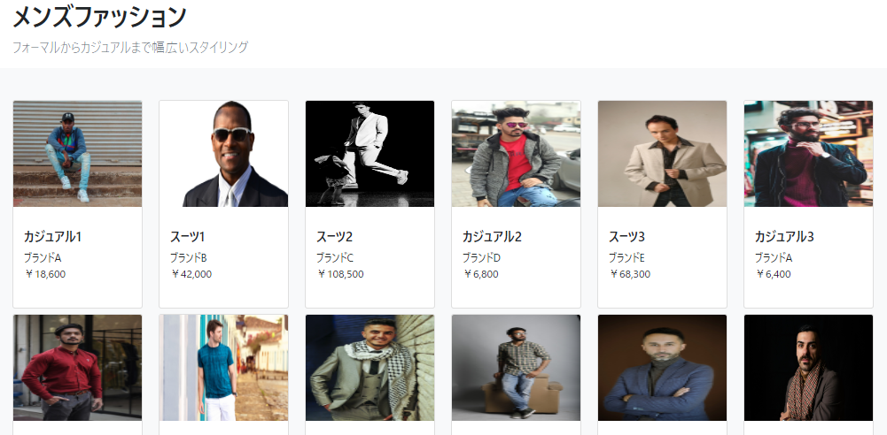
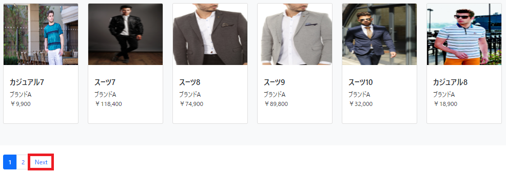
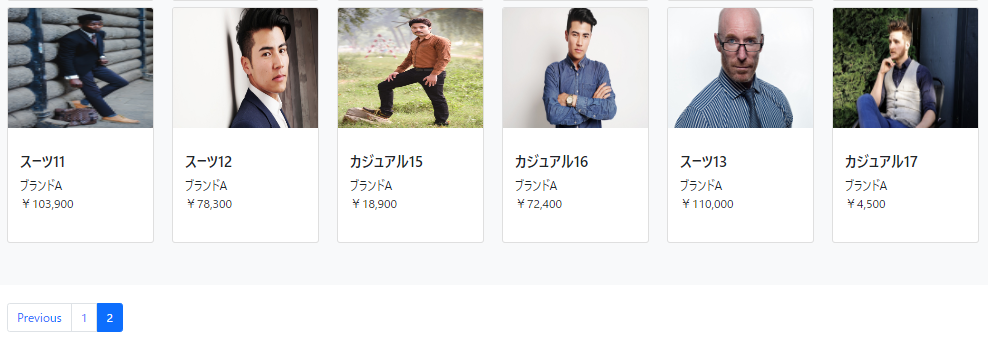
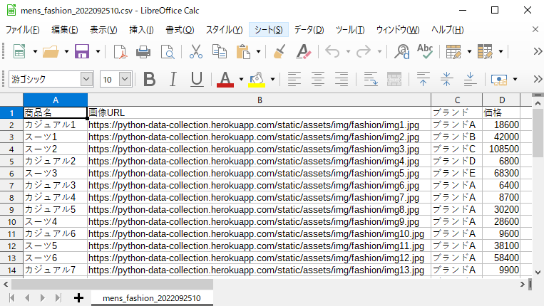
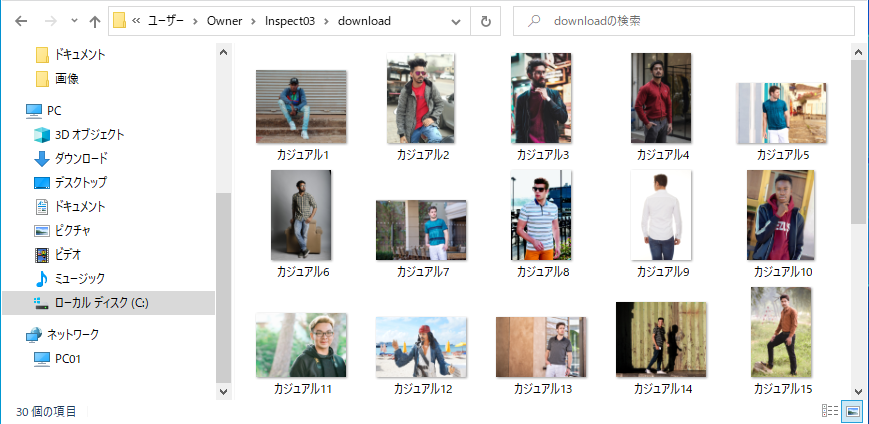

# 練習サイトの商品情報をCSV出力、商品画像をダウンロード
練習サイト内の商品情報をCSV出力、商品画像をダウンロード

 

## 商品情報のデータ収集

 

## ボタン(Next)が押下可能なら次ページ遷移で処理を継続

 

## 最終ページでボタン(Next)が存在しないか上限(10ページ)に達するまで処理を続行

 

## 収集データをCSV出力

 

## 商品画像をダウンロード

 
